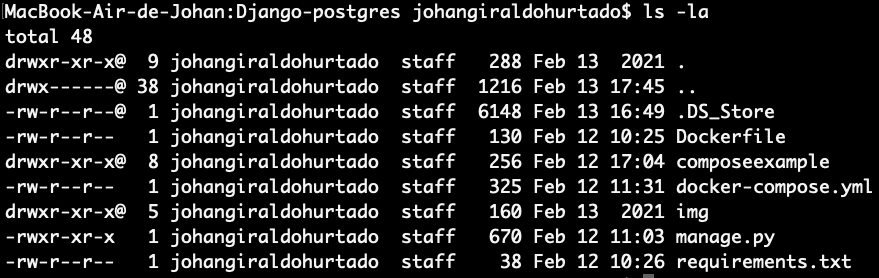
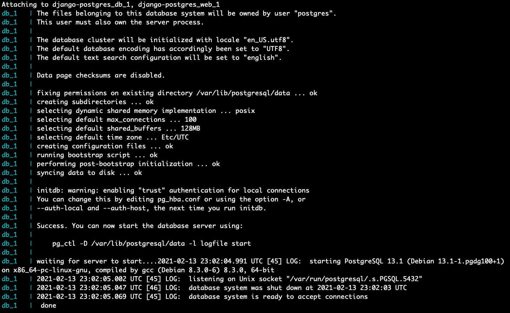
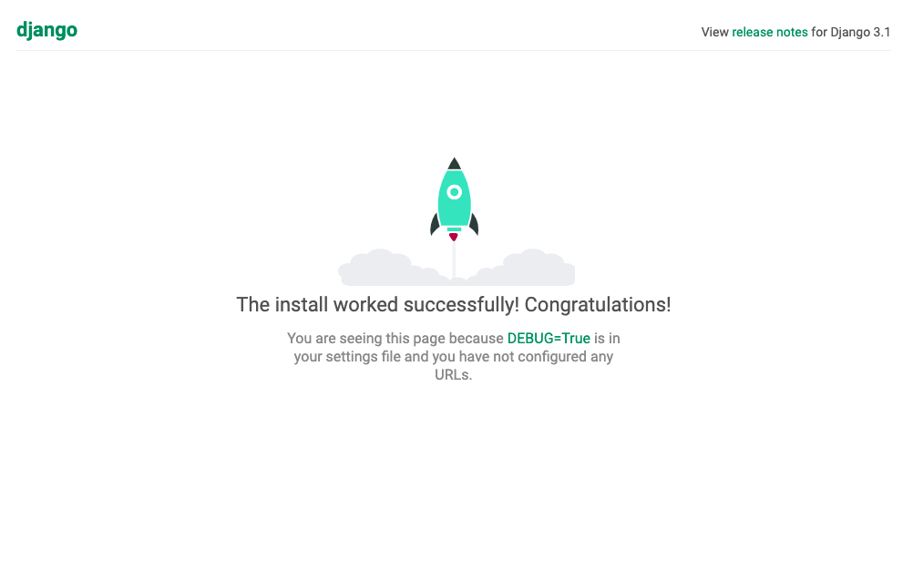

Django-postgres
===

**Inicio rápido: Compose y Django**

Esta guía de inicio rápido demuestra cómo usar Docker Compose para configurar y ejecutar una aplicación Django / PostgreSQL simple. Antes de comenzar, [Instale-compose](https://jsgiraldoh.github.io/Blog/Instalar-Docker-Compose/).

Para este proyecto, necesita crear un **Dockerfile**, un **archivo de dependencias de Python** y un archivo **docker-compose.yml**. (Puede usar una extensión .yml o .yaml para este archivo).

1.	Cree un directorio de proyecto vacío. Puede nombrar el directorio con algo fácil de recordar. Este directorio es el contexto de la imagen de su aplicación. El directorio solo debe contener recursos para construir esa imagen.

2.	Crea un nuevo archivo llamado **Dockerfile** en el directorio de tu proyecto. El **Dockerfile** define el contenido de la imagen de una aplicación a través de uno o más comandos de compilación que configuran esa imagen. Una vez construida, puede ejecutar la imagen en un **contenedor**. Para obtener más información sobre **Dockerfile**, [consulte la guía del usuario de Docker](https://docs.docker.com/get-started/) y [la referencia de Dockerfile](https://jsgiraldoh.github.io/Blog/Dockerfile).

3.	Agregue el siguiente contenido al Dockerfile.

```dockerfile=
FROM python:3

ENV PYTHONUNBUFFERED=1
WORKDIR /code
COPY requirements.txt /code/
RUN pip install -r requirements.txt
COPY . /code/
```

Este **Dockerfile** comienza con una [imagen principal de Python 3](https://hub.docker.com/r/library/python/tags/3/). La imagen principal se modifica agregando un nuevo directorio **code**. La imagen principal se modifica aún más instalando los requisitos de **Python** definidos en el archivo **requirements.txt**.

4.	Guarde y cierre el **Dockerfile**.

5. Cree un **requirements.txt** en el directorio de su proyecto.

Este archivo es utilizado por el 

```
RUN pip install -r requirements.txt
```

comando en su **Dockerfile**.

6. Agregue el software requerido en el archivo.

```
Django>=3.0,<4.0
psycopg2-binary>=2.
```

7. Guarde y cierre el **requirements.txt** archivo.

8. Crea un archivo llamado **docker-compose.yml** en el directorio de tu proyecto.

El **docker-compose.yml** archivo describe los servicios que hacen que su aplicación. En este ejemplo, esos servicios son un servidor web y una base de datos. El archivo de redacción también describe qué imágenes de Docker utilizan estos servicios, cómo se vinculan, los volúmenes que puedan necesitar para montarse dentro de los contenedores. Finalmente, el **docker-compose.yml** archivo describe qué puertos exponen estos servicios. Consulte la **docker-compose.yml** [referencia](https://jsgiraldoh.github.io/Blog/Qué-es-docker-compose) para obtener más información sobre cómo funciona este archivo.

9. Agregue la siguiente configuración al archivo.

```
version: "3"

services:
  db:
    image: postgres
    environment:
      - POSTGRES_DB=postgres
      - POSTGRES_USER=postgres
      - POSTGRES_PASSWORD=postgres
  web:
    build: .
    command: python manage.py runserver 0.0.0.0:8000
    volumes:
      - .:/code
    ports:
      - "8000:8000"
    depends_on:
      - db
```

10. Guarde y cierre el archivo **docker-compose.yml**.

Crea un proyecto Django
===

En este paso, crea un proyecto de inicio de **Django** compilando la imagen a partir del contexto de compilación definido en el procedimiento anterior.

1. Cambie a la raíz del directorio de su proyecto.

2. Cree el proyecto Django ejecutando el comando **docker-compose run** de la siguiente manera.

```
sudo docker-compose run web django-admin startproject composeexample .
```

Esto indica a Compose que se ejecute **django-admin startproject composeexample** en un contenedor, utilizando la imagen **web** y la configuración del servicio. Debido a que la imagen **web** aún no existe, Compose la compila desde el directorio actual, como se especifica en la **build: .** línea en **docker-compose.yml**.

Una vez que se crea **web** la imagen del servicio, Compose la ejecuta y ejecuta el **django-admin startproject** comando en el contenedor. Este comando le indica a Django que cree un conjunto de archivos y directorios que representan un proyecto de Django.

Una vez que se complete el comando **docker-compose**, enumere el contenido de su proyecto.

<br>

Si está ejecutando Docker en Linux, los archivos **django-admin** creados son propiedad de root. Esto sucede porque el contenedor se ejecuta como usuario root. Cambie la propiedad de los nuevos archivos.

```
sudo chown -R $USER:$USER .
```

Si está ejecutando Docker en Mac o Windows, ya debería tener la propiedad de todos los archivos, incluidos los generados por **django-admin**. Enumere los archivos solo para verificar esto.

<br>

Conecta la base de datos
===

En esta sección, configura la conexión de la base de datos para Django.

1. En el directorio de su proyecto, edite el archivo **composeexample/settings.py**.

2. Reemplace **DATABASES = ...** con lo siguiente:

```
# settings.py

DATABASES = {
    'default': {
        'ENGINE': 'django.db.backends.postgresql',
        'NAME': 'postgres',
        'USER': 'postgres',
        'PASSWORD': 'postgres',
        'HOST': 'db',
        'PORT': 5432,
    }
}
```

Esta configuración está determinada por la imagen de Docker de [postgres](https://hub.docker.com/_/postgres) especificada en **docker-compose.yml**.

3. Guarde y cierre el archivo.

4. Ejecute el comando **docker-compose up** desde el directorio de nivel superior de su proyecto.

<br>

En este punto, su aplicación Django debería estar ejecutándose en el puerto 8000 de su host Docker. En Docker Desktop para Mac y Docker Desktop para Windows, vaya a http://localhost:8000 en un navegador web para ver la página de bienvenida de Django.

<br>

5. Enumere los contenedores en ejecución.

En otra ventana de terminal, enumere los procesos de Docker en ejecución con el **docker container ls** comando.

```
CONTAINER ID   IMAGE                                   COMMAND                  CREATED             STATUS             PORTS                                                                                                      NAMES
da3a09ce1c1d   django-postgres_web                     "python manage.py ru…"   6 minutes ago       Up 2 seconds       0.0.0.0:8000->8000/tcp                                                                                     django-postgres_web_1
9b62a081919d   postgres                                "docker-entrypoint.s…"   6 minutes ago       Up 4 seconds       5432/tcp                                                                                                   django-postgres_db_1
```

[Aquí](https://github.com/jsgiraldoh/Django-postgres.git) se puede encontrar una aplicación de ejemplo que ejercita todos los aspectos que se discutieron.

## Referencia

https://docs.docker.com/compose/django/

Kubernets
===

```
cd k8s-resources
```

```
kubectl apply -f 'archivo'
```

```
kubectl port-forward --address 0.0.0.0 svc/my-service 8000 --namespace default
```

Nota: Es importante tener en cuenta, que debe crear un directorio /code, donde se encuentren los archivos generados en el espacio de trabajo (composeexample/, requirements.txt, manage.py). Para que el cluster pueda montar bien el volumen y todo pueda funcionar correctamente.
